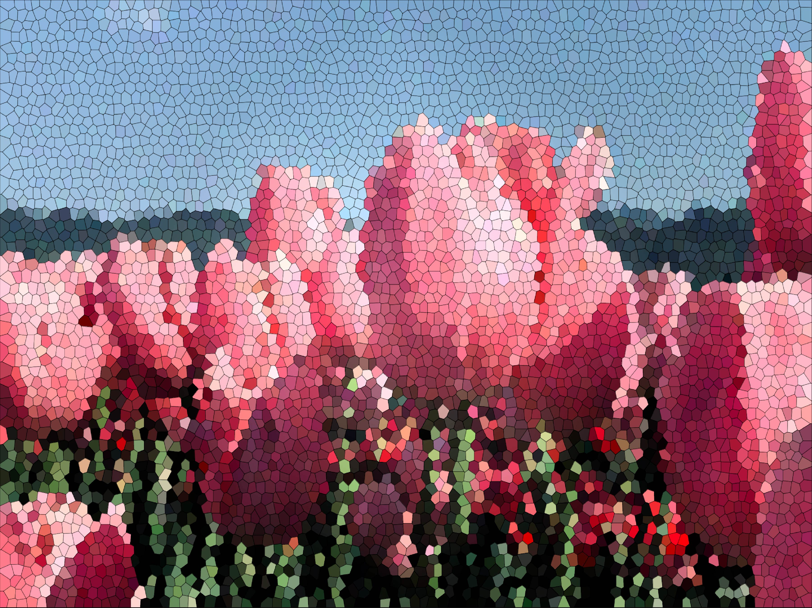
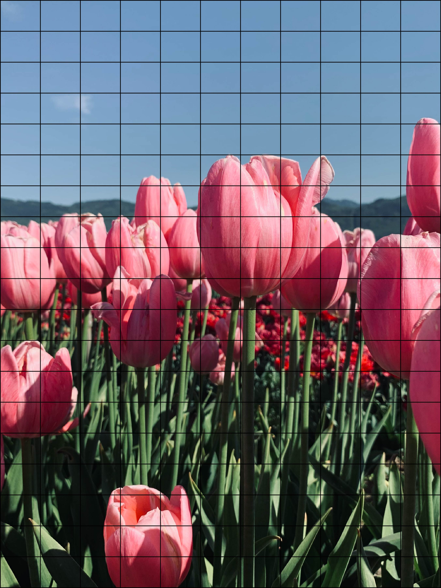
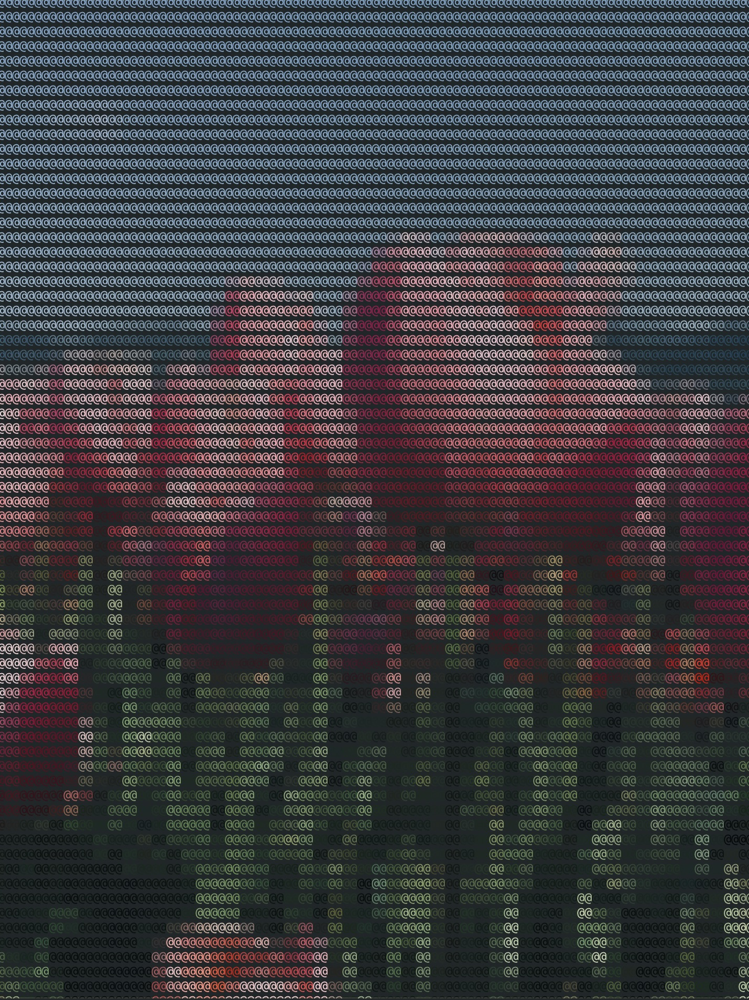

## Introduction
All the images we see on a screen are made up of tiny units called pixels. These pixels are usually so small that they're invisible to the human eye. But what if we could read each individual pixel and translate it into an ASCII character? By doing this, we can recreate an image in a unique, text-based style—where each character acts as a stand-in for a pixel. Of course, everything on screen is still rendered with RGB pixels in the end, but this transformation gives the image a distinctive and stylish look.

## Prerequisite
1. We will be using Python for this project, you can install it by downloading the official installer from https://python.org, or alternatively, you can install it through the terminal, platform-specific instructions are widely available online.
2. Create a project folder and open it with VS Code or your preferred code editor
3. Initiate a virtual environment in your terminal (recommended). Run `python3 -m venv env` to add the environment, and then we can run `source env/bin/activate` to activate it. On windows, you need to type in `.\env\Scripts\activate` instead.
4. Install python library `Pillow` and `Rich`. To install, run the commands `pip install pillow` and `pip install rich`

## The libraries
**Pillow**: Pillow is a Python library for image processing. It's a modern fork of the original PIL (Python Imaging Library), maintained and more feature-rich. And we can do a lot with this powerful library: 
- Open and display images.
- *Access and manipulate individual pixels* (This is what we will be using)
- Convert between formats (e.g., PNG to JPEG).
- Resize, crop, rotate, flip, and filter images.
- Draw text or shapes on images.
- Apply effects like blur, contrast, sharpen.

**Rich**:  A Python library for beautiful formatting in the terminal. It supports:
- *Coloured text*
- Progress bars
- Tables
- Markdown
- Syntax highlighting
- Tracebacks (better error display)

Combine these two library we can make our idea come true, Let's get started!

## Basic Idea
We use the Pillow library to read an image and extract the RGB values of each pixel. With this information, we can print ASCII characters in the corresponding colours to recreate the image. However, images typically contain hundreds or even thousands of pixels, making it impractical to render each one as a separate character. The terminal window, or even the entire screen, wouldn’t be large enough to display them all, and doing so would significantly impact performance. To address this, we **divide the image into a grid** (as shown below) and **use an ASCII character to represent each cell**, effectively compressing the visual data while preserving the overall structure.



As shown in the example image above (with enlarged grid squares for visual clarity), the main idea is to **calculate the average color of each square** and use that color for the ASCII character representing it. The concept is simple, but it does involve some basic yet slightly tricky math. As you might imagine, the final result will look “pixelated” — but that’s exactly what gives it its unique, stylish charm.

## Create a Converter Class
Let’s start by creating a converter class. But before diving into the code, let’s clarify some key variables:
- **pixels** — an array containing all the pixels of the image; each pixel represents an RGB value (Red, Green, Blue) accessible by index.
- **width, height** — the dimensions of the image in pixels (for example, 1080p × 720p).
- **square_size** — the width and height (in pixels) of each square in our grid, your decision
- **W** — the number of squares across each row.
- **H** — the number of squares down each column.
- **data** — a 2D array used to temporarily store squares with each one containing all the pixels within that square.
- **new_data** — used to store the average RGB color of each square, computed from the pixels in that square.
- **char** - choose a character to for the final printing
```python
from PIL import Image
from rich.console import Console 

class AsciiArtConverter:
    def __init__(self, image_path, square_size, char):
        self.image = Image.open(image_path)
        self.pixels = self.image.load() # Load the image into an array of pixels
        self.width, self.height = self.image.size # Get the image size (width and height in pixels)
        self.square_size = square_size
        self.W = self.width // self.square_size
        self.H = self.height // self.square_size
        self.data = []
        self.new_data = []
        self.char = char

	# This function reads all pixels of a square provided with a 
	# starting X coordinate and a starting Y coordinate,
	# and then we save that square to data[]
    def read(self, x_start, y_start):
        sq = []
        y_end = y_start + self.square_size
        x_end = x_start + self.square_size
        for y in range(y_start, y_end):
            for x in range(x_start, x_end):
                sq.append(self.pixels[x, y])
        self.data.append(sq)

	# This function uses the read() function to read the entire image
	# square by square, from left to right, top to bottom. W and H can be
	# cleverly used for locating the starting X,Y coordinates of a square
    def read_all(self):
        for y in range(self.H):
            for x in range(self.W):
                self.read(x * self.square_size, y * self.square_size)

	# This function processes all the pixels stored in data[] for each square
	# and calculates the average color of the square.
	# It does this by summing all the red, green, and blue values separately,
	# then dividing each sum by the total number of pixels in the square.
    def calculate(self):
        for i in range(len(self.data)):
            square = self.data[i]
            red = green = blue = 0
            for p in square:
                red += p[0]
                green += p[1]
                blue += p[2]
            new_val = (red // len(square), green // len(square), blue // len(square))
            self.new_data.append(new_val)

	# Finally, this function calls read_all() and calculate() to populate new_data[]
	# with the average RGB values representing each square.
	# Then, using these values, it prints colorful ASCII characters with the Rich library.
	# A nested loop iterates through each square—column by column, row by row—to display the output.
    def convert_to_ascii(self):
        self.read_all()
        self.calculate()
        index = 0
        console = Console()
        for y in range(self.H):
            for x in range(self.W):
                r = self.new_data[index][0]
                g = self.new_data[index][1]
                b = self.new_data[index][2]
                console.print(self.char, style="rgb({},{},{})".format(r, g, b), end="")
                index += 1
            print()
```

## Start Making Ascii Art
Now let’s import the converter class and start transforming an image into ASCII art. Keep in mind that the larger the image, the more time it will take to process — the time complexity is linear: **O(w × h)**, where **w** and **h** are the image width and height in pixels. We believe there’s a more efficient way to achieve the same result—one that uses less memory and fewer loops. However, for now, let’s stick with this algorithm, as it’s more straightforward. 
```python
from ascii import AsciiArtConverter
image_path = 'tunip.jpg'
square_size = 40 #40 pixels
converter = AsciiArtConverter(image_path, square_size, "@@")
converter.convert_to_ascii()
```



## Notes
- **Choose an appropriate `square_size`:** Since image sizes vary widely—some images have only a few hundred pixels per row, while others have thousands—you should adjust the `square_size` accordingly to balance detail and performance.
- **Why use double characters like "@@"?:** Terminals typically print characters with some vertical spacing. If you use a single character, the output can appear vertically stretched. Doubling the character width helps maintain the correct aspect ratio. Keep in mind this behaviour may vary depending on your terminal.
- **Handling character compatibility with Rich:** If certain characters don’t render well with the `Rich` library, try using different characters until you find one that display properly.
## GitHub
You are free to use this code however you want, you can clone this project from our repository here: 

## Final Words
Welcome to this very first official blog post of Alcyonite! We hope you find it clear and easy to follow. If it sparks your creativity, feel free to share it with your friends. And don’t hesitate to send us your feedback — it helps us improve and create even better content for you in the future!
